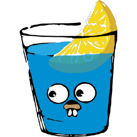

 

###  Hi, I'm Lucas De Lima — Backend Developer working with Golang & Kotlin (Android)

 

## Backend Developer in transition to Go and Kotlin

Currently working mainly with **TypeScript** and exploring **Go** as a long-term backend stack. 
I believe in **clean, practical code** and **continuous learning** through real projects.

 

## About Me

> - 👨🏽‍💻 <b>Currently pursuing a degree in Systems Analysis and Development</b> 
> - 🤔 <b>Backend developer</b> interested in Go, Kotlin (Android), and Jetpack Compose 
> - 💼 <b>Goal:</b> Complete my degree and specialize in Software Engineering 
> - 💬 <b>Always learning by doing</b> and open to helping others 
> - 📫 <b>Open to connections and collaborations</b>

 

  

    <h2>🧠 Main Expertise</h2>
    <table style="width:100%;">
      <tr>
        <td align="center">
           
          TypeScript
        </td>
        <td align="center">
           
          Node.js
        </td>
        <td align="center">
           
          Java
        </td>
        <td align="center">
           
          Spring Boot
        </td>
      </tr>
      <tr>
        <td align="center">
           
          Docker
        </td>
        <td align="center">
           
          MySQL
        </td>
        <td align="center">
           
          MongoDB
        </td>
      </tr>
    </table>
  

  

    <h2>📚 Currently Exploring</h2>
    <table style="width:100%;">
      <tr>
        <td align="center">
           
          Golang
        </td>
        <td align="center">
           
          Gin
        </td>
        <td align="center">
           
          Kotlin
        </td>
        <td align="center">
           
          Android
        </td>
      </tr>
    </table>
  

  

    <h2>🛠️ Dev Tools & Infra</h2>
    <table style="width:100%;">
      <tr>
        <td align="center">
           
          Git
        </td>
        <td align="center">
           
          Jira
        </td>
        <td align="center">
           
          Bitbucket
        </td>
      </tr>
      <tr>
        <td align="center">
           
          Azure
        </td>
        <td align="center">
           
          Google Cloud
        </td>
        <td align="center">
           
          Docker
        </td>
      </tr>
    </table>
  

  

    <h2>💻 Dev Environment</h2>
    <table style="width:100%;">
      <tr>
        <td align="center">
           
          VS Code
        </td>
        <td align="center">
           
          IntelliJ IDEA
        </td>
        <td align="center">
           
          Android Studio
        </td>
        <td align="center">
           
          Windows
        </td>
        <td align="center">
           
          Linux
        </td>
      </tr>
    </table>
  

## Profile stats 📊

<table>
  <tr>
    <td>
      
    </td>
    <td>
      
    </td>
  </tr>
</table>

 

<h4> </h4>

## Contact me 💬

<h4> </h4>

 

<h4> </h4>

 
<h4> </h4>

 <em><b>If you'd like to connect or collaborate, don't hesitate to get in touch.</b></em>

 

<!---
lucas-de-lima/lucas-de-lima is a ✨ special ✨ repository because its `README.md` (this file) appears on your GitHub profile.
You can click the Preview link to take a look at your changes.
--->
